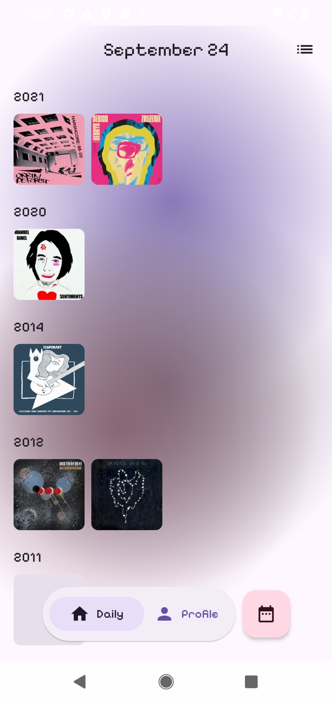
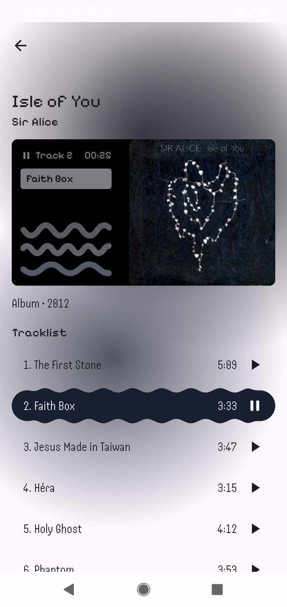
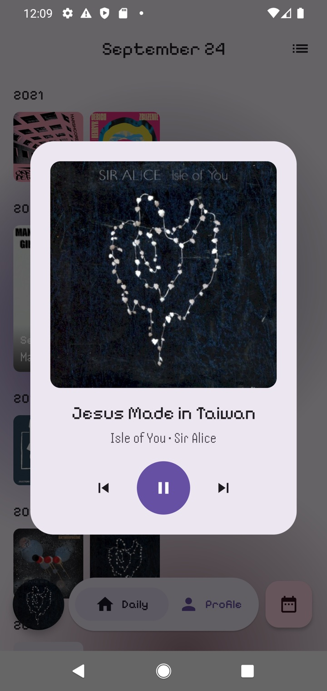
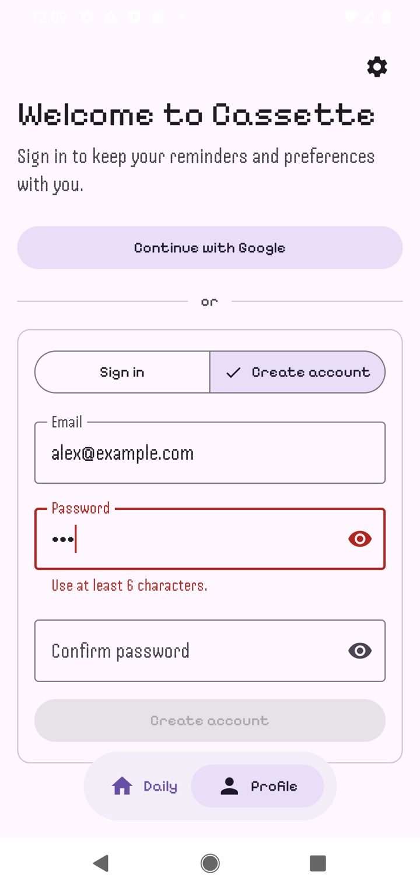

# Cassette

An Android app, built with Kotlin and Jetpack Compose, that shows every album released on today's
date across the years, with 30-second previews of their tracks.

<p>
  
  
  
  
</p>

All screenshots are in [`docs/screenshots/`](docs/screenshots).

## Features

- **Daily:** the albums released on a month and day, across all years, as a cover grid grouped
  by year (or a list). A calendar jumps to any other day.
- **Album:** tracklist, streaming links and, when available, genres and rating. Swipe sideways through the day's albums.
- **Previews:** 30-second clips from iTunes. Autoplay moves through the album and then on to the
  day's next albums, keeps playing after you leave the album, and keeps playing in the background
  with a media notification.
- **Profile:** email or Google sign-in, a daily reminder notification, and an in-app language
  picker (English and Spanish) on Android 13 and later.

## Requirements

- Android Studio (latest stable)
- JDK 11
- Android SDK 37 (compile/target), min SDK 24

## Getting started

```bash
git clone <repo-url>
cd Cassette
./gradlew build
```

Or open the project directly in Android Studio and run the `app` configuration.

### iOS (in progress)

An iOS app lives in [`iosApp/`](iosApp): SwiftUI screens on top of the same domain and data code
as Android, shared through Kotlin Multiplatform (`:domain` and `:data` build a `Shared` framework).
It has the Daily screen and album details so far; previews, sign-in and settings are still to come.

- Xcode 26 and the iOS 26 simulator runtime
- A JDK for the Gradle build phase: `JAVA_HOME`, or Android Studio's bundled one

Open `iosApp/iosApp.xcodeproj` and run the `iosApp` scheme. To run on an iPhone, put your team in
`iosApp/Signing.local.xcconfig` (git-ignored) as `DEVELOPMENT_TEAM = <team ID>`. The project is generated from
`iosApp/project.yml` with [XcodeGen](https://github.com/yonaskolb/XcodeGen); after editing that
file, run `xcodegen generate` in `iosApp/`.

## Data sources

| Source | Used for | How |
|---|---|---|
| [MusicBrainz data dump](https://musicbrainz.org/doc/MusicBrainz_Database/Download) | Which albums were released on each day, their tracklists and streaming links | Downloaded and joined offline into a day index |
| [MusicBrainz API](https://musicbrainz.org/doc/MusicBrainz_API) (`musicbrainz.org/ws/2`) | Full album details, including rating and genres, when an album isn't in the index | Live requests, limited to one per second with an identifying `User-Agent`, per MusicBrainz's rate limits |
| [Cover Art Archive](https://coverartarchive.org) | Album covers | `coverartarchive.org/release-group/{id}/front-250` (grid) and `front-500` (album screen) |
| [iTunes Search API](https://performance-partners.apple.com/search-api) (`itunes.apple.com`) | 30-second track previews | `lookup` and `search` requests, see [How previews are matched](#how-previews-are-matched) |

Every album is identified by its MusicBrainz **release-group ID**, the same in the day index, in
the MusicBrainz API and in the Cover Art Archive.

## How albums are processed

### Offline: building the day index

MusicBrainz's API can't answer "every album released on June 17, in any year", and one query per
year would be far too slow under its rate limit. So the join happens offline, against the public
data dump:

1. **Download.** Find the latest dump and stream only the tables needed from `mbdump.tar.bz2` and
   `mbdump-derived.tar.bz2`.
2. **Pick albums.** Keep release groups whose primary type is **Album** and take their
   first release date (year, month, day) from `release_group_meta`, together with the credited
   artist name.
3. **Pick one release per album.** A release group can have many releases (editions, countries,
   formats). One is picked, preferring an **Official** release, then the lowest release ID
   so the choice is stable between runs.
4. **Tracks and streaming links.** Read that release's tracklist (position, title, length)
   and its "streaming" / "free streaming" links, classified by host as Spotify, Apple Music or
   YouTube Music.

Ratings and genres aren't in the index. Ratings change too often to freeze, and the tables that
link genres to albums aren't part of the public dump. So an album served from the index shows
neither; only albums fetched live from MusicBrainz have them.

### In the app

- **Daily screen** (`GetAlbumsByDayUseCase`): loads the day's albums from the index, drops albums
  without a release date, and groups them by year, newest first. The album pager uses the same
  order.
- **Album screen** (`GetAlbumDetailUseCase`): reads the album from the index first. If it isn't
  there, it falls back to the MusicBrainz API: a release-group lookup with artist credits, genres
  and ratings, plus a browse of its official releases for the tracklist.

## How previews are matched

Previews come from iTunes, which names albums and songs differently from MusicBrainz. The app
only shows a preview when it's confident the match is right: a wrong album's previews are worse
than none.

1. **Find the album on iTunes** (`ItunesRepositoryImpl`):
   - If the album has an **Apple Music link** from MusicBrainz, its collection ID and storefront
     are read straight from the URL.
   - Otherwise the app **searches** iTunes for "artist title" (top 5 albums) and accepts a result
     only if both the artist and the album title match exactly after normalizing (see below).
2. **Get its songs** with an iTunes `lookup`, keeping songs that have a preview URL, sorted by
   disc and track number.
3. **Match songs to tracks** (`GetTrackPreviewsUseCase`):
   - First by **normalized title**. Normalizing lowercases, drops bracketed parts ("(feat. X)",
     "[Bonus Track]") and " - suffix" parts ("- Remastered 2009"), then keeps only letters and
     digits.
   - Tracks still unmatched are paired **by position**, but only when iTunes has exactly as many
     songs as the album has tracks. Otherwise, bonus tracks or another edition would shift
     everything.
   - Tracks with no match simply get no play button.

**Playback** uses one Media3 ExoPlayer for the whole app. An app-wide queue (`PreviewQueue`)
handles autoplay: the album's next previewable track, then the day's next album that has
previews, looked up on the fly. A Media3 `MediaSessionService` keeps it playing in the background
with a notification.

## Languages

All UI text is in `app/src/main/res/values/strings.xml` (English) and `values-es/strings.xml`
(Spanish). Lint treats a missing translation as an error. Debug builds enable pseudolocales
(English (XA), Arabic (XB) in developer options) to spot hardcoded text.

## License

Licensed under the [MIT License](LICENSE).
